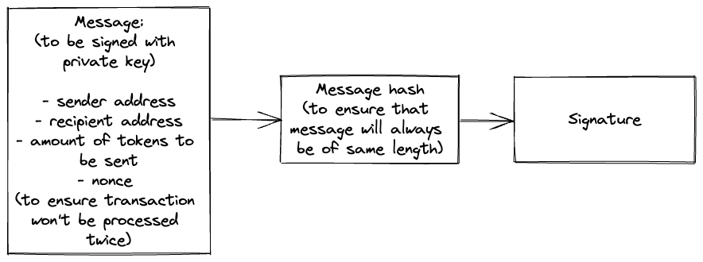

# Final Project - EVM Token Bridge

## 0. Overview
This final project is part of the requirements to fulfil in order graduate from LimeAcademy. Specifically, the project aims to build a EVM token bridge which allows users to swap ERC-20 tokens between two chains. 

## 1. User Stories
- As a user, I want to select a token (from my wallet or by address):
    - There should be a separate “Transfer” view (can be a page, tab or other)
    - List ERC-20 tokens (names) from the wallet (in a dropdown for example)
    - The selected ERC-20 contract address is shown in a text field
    - Give option to manually paste a token contract address
- As a user, I can select a target chain:
    - List target chains in a dropdown
    - The current active chain should be grayed out in the dropdown
- As a user, I want to be able to lock tokens in the bridge contract:
    - Should happen in “Transfer” view
    - When the Send button is clicked, three things should happen:
        - Approve the bridge contract as a token spender for the user’s wallet
        - Send a transaction that initiates the bridge operation
        - Emit blockchain event about the operation
- As a user, I can connect to the target chain:
    - Provide a button that will initiate the change of the network
- As a user, I want to be able to claim the locked tokens:
    - There should be a separate “Claim” view (can be a page, tab or other)
    - The “Claim” button should be active only if there are tokens to be claimed
    - The button action should match the type of the operation
- As a user, I can bridge the tokens (previously claimed) back to their native chain:
    - Should happen in “Transfer” view
    - The “Send” button should detect if this is a previously claimed token or a native one
    - When the Send button is clicked, three things should happen:
        - Approve the bridge contract as a token spender for the user’s wallet
        - Send a transaction that initiates the bridge operation
        - Emit blockchain event about the operation
- As a user, I can claim the tokens on the native chain and receive the original ones:
    - Should happen in the “Claim” view
    - The “Claim” button should be active only if there are tokens to be claimed
    - The button action should match the type of the operation

## 2. Overall Architecture 

### Design for V1


### Bonus feature 1


### Bonus feature 2


## 3. Run application

To run local nodes, run ```npx hardhat node```.

To deploy contracts locally, run ```npx hardhat run --network localhost scripts/deploy-local-EthBridge.ts```. 
Note that this step is necessary for tests to run locally. 

To deploy contracts to ```goerli``` testnet, run ```npx hardhat run --network goerli scripts/deploy-local-EthBridge.ts```. 

- ```EthBridge.sol``` is deployed to ```0xaac8e2a85454222ad0407Ce1580cdEBC86eC5ccC```. 
- ```PolygonBridge.sol``` is deployed to ```0xfF97997A860BcD0E79E3889aaca6fA5Dd071a4a3```.
- ```WERC20.sol``` is deployed to ```0x204448ff00888A6b11D7216985DDeAED91dae0e2```.
- ```WToken.sol``` is deployed to ```0xE2E96cBCE11AD1A2557C2aa03Dff9e73c3d812F8```.